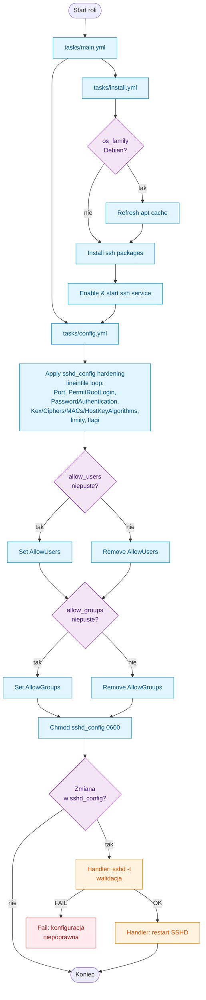

#  ssh-hardening

Rola instaluje i twardzi serwer OpenSSH (pakiety + podstawowa konfiguracja bezpieczeństwa) na dystrybucjach Debian/Ubuntu, RHEL/AlmaLinux oraz Alpine.

---

## Wymagania i kompatybilność

- Ansible >= 2.9 z uprawnieniami `become` na hostach.
- Obsługiwane rodziny: Debian/Ubuntu, RHEL/AlmaLinux (EL 7/8/9), Alpine.
- Rola korzysta z natywnych modułów pakietów (`apt`, `yum`, `apk`, `package`, `lineinfile`).

---

## Co robi rola

- Instaluje serwer SSH odpowiednim menedzerem pakietow.
- Upewnia sie, ze usluga SSH jest uruchomiona i wlaczona przy starcie systemu.
- Ustawia port, wymusza logowanie kluczem, blokuje roota/hasla i naklada limity sesji.
- Konfiguruje bezpieczne algorytmy Kex/Ciphers/MACs/HostKeyAlgorithms oraz flagi bezpieczenstwa (forwarding, X11, baner).
- Pozwala nadpisywac tylko wybrane wpisy `in_sshd_config`; brakujace pola sa uzupelniane z `var_sshd_default_config`.
- Wymusza wlasciciela/grupe `root` oraz tryb `0600` na pliku `sshd_config`.
- Usuwa dyrektywy `AllowUsers`/`AllowGroups` gdy listy sa puste.
- Handler `Restart SSHD` najpierw waliduje konfiguracje (`sshd -t`), potem restartuje usluge.

---

## Architektura / Flow



---

## Szybki start

```yaml
- hosts: all
  become: true
  roles:
    - role: ssh-hardening
      vars:
        in_sshd_config:
          port: 2222
          permit_root_login: "no"
          password_authentication: "no"
```

> Nowe zmienne wejscia roli maja prefiks `in_`.

---

## Zmienne

- `in_sshd_config.*` – glowny blok konfiguracyjny: port, logowanie (permit_root_login, password_authentication, pubkey_authentication, authentication_methods), limity (max_auth_tries, max_sessions, login_grace_time, client_alive_interval, client_alive_count_max), listy dostepu (allow_users, allow_groups), algorytmy (kex_algorithms, ciphers, macs) oraz flagi bezpieczenstwa (allow_tcp_forwarding, gateway_ports, x11_forwarding, permit_user_environment, banner, permit_empty_passwords).
- `in_debug` (domyslnie `false`) – gdy `true`, wypisuje wykryty `ansible_facts.os_family `.
- `var_sshd_config_path` (domyslnie `/etc/ssh/sshd_config`) – sciezka do konfigu `sshd`.
- `var_sshd_service` oraz `var_sshd_packages` – wyznaczane dynamicznie na podstawie rodziny systemu; zwykle nie trzeba ich nadpisywac.
- Puste listy/ciagi (np. `banner`, `kex_algorithms`, `ciphers`, `macs`, `allow_users`, `allow_groups`) pomijaja wpisy w `sshd_config`.

### Domyslne utwardzenie

```yaml
in_sshd_config:
  port: 22
  permit_root_login: "no"
  password_authentication: "no"
  pubkey_authentication: "yes"
  authentication_methods: "publickey"
  permit_empty_passwords: "no"
  max_auth_tries: 3
  max_sessions: 2
  login_grace_time: "30s"
  client_alive_interval: 300
  client_alive_count_max: 2
  allow_tcp_forwarding: "no"
  gateway_ports: "no"
  x11_forwarding: "no"
  permit_user_environment: "no"
  banner: "/etc/issue.net"
  allow_users: []
  allow_groups: []
  kex_algorithms:
    - curve25519-sha256@libssh.org
    - curve25519-sha256
  ciphers:
    - chacha20-poly1305@openssh.com
    - aes256-gcm@openssh.com
    - aes128-gcm@openssh.com
  macs:
    - hmac-sha2-512-etm@openssh.com
    - hmac-sha2-256-etm@openssh.com
  host_key_algorithms:
    - ssh-ed25519
    - rsa-sha2-512
    - rsa-sha2-256
```

---

## Contributions

Jeśli masz pomysły na ulepszenia, zgłoś problemy, rozwidl repozytorium lub utwórz Merge Request. Wszystkie wkłady są mile widziane!
[Contributions](CONTRIBUTING.md)

---

## License

[Licencja](LICENSE) oparta na zasadach Creative Commons BY-NC-SA 4.0, dostosowana do potrzeb projektu.

---

## Author Information

|  |
|---------------------------------------------------------------------------------------------------|
| [Maciej Rachuna](https://gitlab.commrachuna)                                                      |
